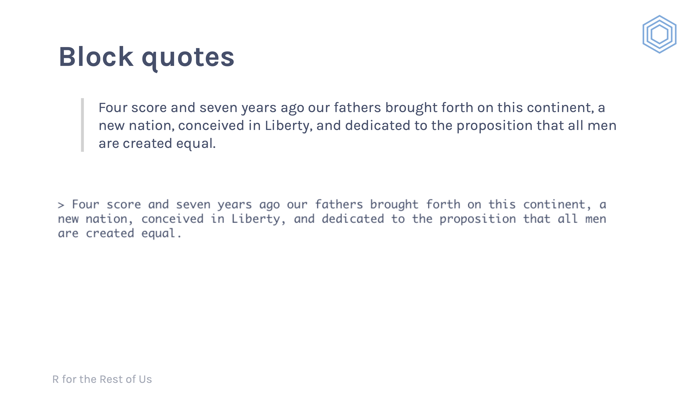

# Overview {-}

These are instructions for making an R for the Rest of Us online course. More info will be added soon.

# Curriculum Development

You'll develop your curriculum as a combination of slides, exercises, and examples. Here's how I've used the three, but please note that this is just my approach. I want you to think about what's going to work best for your materials.

I start out each section of my course with slides. In my courses, a section is RMarkdown or data wrangling and analysis or data visualization. I have a slide with the section title that I display as I talk through an overview of that section.

Each lesson within a section should be short and focus on a single topic. As you're making your materials, if you think that a video demonstrating the concept will go beyond 5 minutes or so, consider breaking it into multiple lessons. 

I typically start a lesson with slides. I'll start with a slide that lays out the concept. I'll often have code on this slide. 


I'll usually then flip over to RStudio to show myself typing out the code to demonstrate this concept in an exercises file. Here's an example:

<iframe src="https://player.vimeo.com/video/418140740" width="640" height="360" frameborder="0" allow="autoplay; fullscreen" allowfullscreen></iframe>

In my Fundamentals of R course, I had a [series of exercises laid out in an RMarkdown file](https://github.com/rfortherestofus/fundamentals/blob/master/data-visualization-exercises.Rmd). I use the markdown text to give instructions and then have blank code chunks where people put their solutions. See an example [here](https://github.com/rfortherestofus/fundamentals/blob/master/data-visualization-exercises.Rmd#L33:L35).


# Course Materials

## GitHub Repo

Each course will have a GitHub repo on the R for the Rest of Us organization account. David will create this and add you to the repo. 

## Project Organization

## Slides

### Slides Template

Slides for R for the Rest of Us courses are made using the [`xaringan` package](https://github.com/yihui/xaringan). 

There is a custom template to use to make slides in the R for the Rest of Us style. You can access this by installing the [`rruthemes` package](https://github.com/rfortherestofus/rruthemes) using the following code:


```r
devtools::install_github("rfortherestofus/rruthemes")
```

Please create a slides directory where all of your slides will live. 

You can create slides as follows:

<iframe src="https://share.getcloudapp.com/P8uEwzAZ?embed=true" width="100%" height="500" style="border:none" frameborder="0" allowtransparency="true" allowfullscreen="true"></iframe>


### Slides Organization

Each lesson should have a My Turn and a Your Turn section. The slide for the My Turn section should have an orange background and the slide for the Your Turn section should have a blue background. 

To do this, add the class `my-turn` and the class `inverse` to your slides as follows:


# RStudio Setup

## Defaults

Please use default fonts while you are teaching. Pretty as they are, please don't use fonts like [Fira Code](https://benjaminlmoore.wordpress.com/2017/07/19/ligature-fonts-for-r/), as the differences in how they render the assignment operator, for example, can be confusing for newbies.

# Recording Videos

## Streamlabs Setup

I use the free [Streamlabs](https://streamlabs.com/) to record videos. It's designed for streaming online, but you can also use it to record locally. 

I use all of the default settings for audio and video.

I record videos with my screen displaying and myself on video in the bottom right. I think it's important that the instructor be on video to build rapport with students. I made a video to show I set this up in Streamlabs.

<iframe src="https://player.vimeo.com/video/441483074" width="640" height="360" frameborder="0" allow="autoplay; fullscreen" allowfullscreen></iframe>

And here's the video I reference in the above video showing the result.

<iframe src="https://player.vimeo.com/video/441483009" width="640" height="480" frameborder="0" allow="autoplay; fullscreen" allowfullscreen></iframe>

You can download the circle mask I use to make the video of you round [here](images/circle-mask.png).


## Recording Procedures

I'm generally not that fussy about making sure everything is super high quality, but please use an external camera and external mic to record. Please put your mic as close to you as possible, but make sure it doesn't show up on camera. If you are interested in learning some tips about high-quality screencasting, [this guide from Egghead](https://howtoegghead.com/instructor/screencasting/) is helpful. 

My general experience is that it's easier to record videos by just hitting record and going through your lesson as many times as you need to. I often make mistakes along the way, but that's ok because we can edit them out after the fact. Just go back to right before you messed up and start again! You can, of course, record so you get a single high-quality take, but I find that hard to do and way too much pressure. 

## Sharing Videos with David

Please share the raw videos you record in the Google Drive folder that David sets up for you. Make sure they are labelled so I know what each video is.


